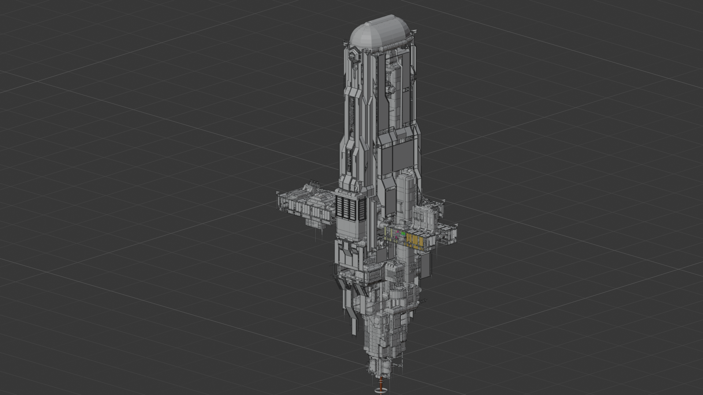

# Prey (2017) Level & Asset Extraction for Blender

This repository contains tools and scripts for extracting **Prey (2017)** level data and game assets, converting CryEngine `.cgf` models to `.usda`, and reconstructing the levels inside **Blender**.

The general workflow is:

```text
Prey .pak files
      │
      ├── Objects-part*.pak
      │       ↓
      │   PreyConvert
      │       ↓
      │   CryEngine .cgf assets
      │       ↓
      │   Cryengine-Converter
      │       ↓
      │   Blender-readable .usda assets
      │
      └── Levels/Campaign/*.pak
              ↓
          PreyConvert
              ↓
          Extracted level files
              ↓
      terrain.dat / indoor.dat
              ↓
       Extraction scripts
              ↓
       prey_import_combined.csv
              ↓
          Blender importer
```

---

# 1. Requirements

You will need:

- **Prey (2017)** installed on PC
- **Python 3**
- **Blender**
- **PreyConvert.exe**
- **Cryengine-Converter**
- The extraction and Blender scripts from this project
- Enough free disk space for the extracted and converted assets

> **Warning**
>
> A complete extraction of Prey's assets contains many thousands of files.  
> Converting all `.cgf` files to `.usda` can take a long time and requires a significant amount of disk space (>30 GB).

---

# 2. Tools

## PreyConvert

PreyConvert can be obtained through the Prey Modding Guide:

https://rosodudemods.wordpress.com/prey-modding-guide/

It converts Prey's `.pak` files into normal archive files which can then be extracted.

Basic usage:

```cmd
PreyConvert.exe "C:\Path\To\File.pak"
```

Example:

```cmd
PreyConvert.exe "C:\Games\Prey\GameSDK\Objects-part0.pak"
```

The resulting archive can then be extracted with Windows, 7-Zip, WinRAR, or another ZIP-compatible tool.

---

## Cryengine-Converter

Download:

https://github.com/Markemp/Cryengine-Converter

This tool converts CryEngine assets such as `.cgf` into formats that Blender can read.

For this workflow, the assets are converted to:

```text
.usda
```

which can be imported directly into Blender.

---

# 3. Extract the Prey object archives

Locate your Prey installation directory.

Inside:

```text
Prey\GameSDK
```

you should find the object archives.

Extract:

```text
Objects-part0.pak
Objects-part1.pak
Objects-part2.pak
Objects-part3.pak
Objects-part4.pak
Objects-part5.pak
Objects-part6.pak
Objects-part7.pak
```

Run `PreyConvert.exe` for every archive.

Example:

```cmd
PreyConvert.exe "C:\Games\Prey\GameSDK\Objects-part0.pak"
PreyConvert.exe "C:\Games\Prey\GameSDK\Objects-part1.pak"
PreyConvert.exe "C:\Games\Prey\GameSDK\Objects-part2.pak"
```

Continue through `Objects-part7.pak`.

After conversion, extract the resulting archives.

---

# 4. Create the asset base directory

Copy the assets you want to convert into a common base directory.

It is **important to preserve the original CryEngine directory structure**.

For example, if Prey references:

```text
Objects\Environment\Architecture\Base\AccessPanel\_A\Assets.cgf
```

your local directory should look similar to:

```text
Assets_Base
└── Objects
    └── Environment
        └── Architecture
            └── Base
                └── AccessPanel
                    └── _A
                        └── Assets.cgf
```

For example:

```text
C:\YourFolder\3D_Models
```

could contain:

```text
C:\YourFolder\3D_Models\Objects\Environment\Architecture\...
```

Preserving this hierarchy is important because CryEngine assets may reference materials, textures, and other resources using paths relative to the game data directory.

---

# 5. Convert CGF assets to USDA

The provided helper script:

```text
batch_convert_folder.py
```

can recursively convert the extracted `.cgf` assets.

Create a file such as:

```text
convert_all_assets.bat
```
next to `batch_convert_folder.py`.

Example:

```bat
@echo off
setlocal

REM ---------------------------------------------------------
REM Adjust these four paths
REM ---------------------------------------------------------

set "INPUT_ROOT=C:\Path\To\Your\Assets"
set "OUTPUT_ROOT=C:\Path\To\Your\Destination"
set "CGF_CONVERTER=C:\Path\To\cgf-converter.exe"
set "OBJECT_DIR=C:\Path\To\Your\Extracted\GameTextures"

python "%~dp0batch_convert_folder.py" ^
    "%INPUT_ROOT%" ^
    "%OUTPUT_ROOT%" ^
    --converter "%CGF_CONVERTER%" ^
    --objectdir "%OBJECT_DIR%" ^
    --node-transform auto

pause
```

Example configuration:

```bat
set "INPUT_ROOT=C:\YourFolder\3D_Models"
set "OUTPUT_ROOT=C:\YourFolder\3D_Models_USDA"
set "CGF_CONVERTER=C:\Tools\Cryengine-Converter\cgf-converter.exe"
set "OBJECT_DIR=C:\YourFolder\3D_Models"
```

Then run:

```cmd
convert_all_assets.bat
```

## Important

For thousands of assets this process can take a considerable amount of time.

Do not interrupt the converter unless necessary.

The resulting directory should preserve the original asset hierarchy:

```text
3D_Models_USDA
└── Objects
    └── Environment
        └── Architecture
            └── ...
                └── asset.usda
```

The path structure is important later because the level extraction scripts use the CryEngine asset path to locate the corresponding `.usda` file.

---

# 6. Extract the Prey levels

Prey's campaign level archives are located below:

```text
Prey\GameSDK\Levels\Campaign
```

Convert each required level `.pak` with `PreyConvert.exe`.

Example:

```cmd
PreyConvert.exe "C:\Games\Prey\GameSDK\Levels\Campaign\CrewFacilities\level.pak"
```

After conversion, extract each level into its **own directory**.

A possible structure is:

```text
prey_levels
├── Arboretum
│   └── level
├── CargoBay
│   └── level
├── CrewFacilities
│   └── level
├── LifeSupport
│   └── level
├── Lobby
│   └── level
├── PowerPlant
│   └── level
├── Psychotronics
│   └── level
├── ShuttleBay
│   └── level
└── ...
```

The exact files available inside a level vary.

Important files include data such as:

```text
level\
level\terrain\
level\terrain\terrain.dat
level\indoor.dat
mission_mission0.xml
```

Not every level necessarily uses the same combination of files.

---

# 7. Extract outdoor objects

Outdoor/static level objects stored in the terrain data are extracted with:

```text
extract_prey_terrain.py
```

Pass the level's `terrain` directory.

Example:

```cmd
python extract_prey_terrain.py "C:\YourLevelsFolder\CrewFacilities\level\terrain"
```

The script analyzes the CryEngine terrain/object data and extracts the object instances required for rebuilding the level.

---

# 8. Extract indoor objects

Indoor object placement is extracted with:

```text
extract_prey_indoor.py
```

Pass the level root directory:

```cmd
python extract_prey_indoor.py "C:\YourLevelsFolder\CrewFacilities\level"
```

This extracts the indoor/static object instances used by the level.

---

# 9. Resolve assets and create the Blender import CSV

After running both extraction steps, execute:

```text
write_assets.py
```

Example:

```cmd
python write_assets_csv.py "C:\YourLevelsFolder\CrewFacilities\level\terrain" --model-base "C:\YourFolder\3D_Models_USDA"
```

`--model-base` must point to the directory containing your converted `.usda` asset hierarchy.

For example:

```text
C:\YourFolder\3D_Models_USDA
└── Objects
    └── Environment
        └── ...
```

The final output used by Blender is:

```text
prey_import_combined.csv
```

This CSV contains the resolved model paths together with the instance transforms and other level information.

---

# 10. Import into Blender

Open Blender and switch to:

```text
Scripting
```

Open one of the supplied Blender importer scripts.

Change the path inside the script so that it points to the generated:

```text
prey_import_combined.csv
```

Then press:

```text
Run Script
```

Three import variants are available.

---

## Option A — Optimized layer import

```text
import_blender_by_layer_optimized.py
```

**Recommended for large levels.**

This importer:

- imports the assets
- sorts them into collections based on their level/layer information
- combines assets within the collections
- drastically reduces the number of Blender objects
- improves viewport performance

The disadvantage is that placed instances are no longer available as completely independent Blender objects.

Use this version if your main goal is:

- exploring the level
- rendering the level
- working with very large levels
- keeping Blender responsive

---

## Option B — Layer import

```text
import_blender_by_layer.py
```

This importer:

- imports the individual assets
- organizes them into separate collections
- preserves the layer structure
- keeps more objects individually editable

This is useful when you want a balance between organization and editability.

Because many individual Blender objects are created, very large levels can become slow.

---

## Option C — Full import

```text
import_blender_full.py
```

This imports all placed assets individually.

Advantages:

- every instance remains individually selectable
- easiest version for inspecting individual objects
- maximum editability

Disadvantages:

- very large number of Blender objects
- high RAM usage
- slow imports
- slow viewport
- large `.blend` files

For complete Prey levels this can take a long time.

---

# 11. Blender Scene

The imported Prey levels and assets are **not positioned around Blender's world origin (`0, 0, 0`)**. They retain their original in-game coordinates and may therefore appear several hundred or even several thousand meters away from the origin.

If the imported geometry is not immediately visible:

1. Increase the Blender viewport **Clip End** distance to around:

```text
5000 m
```

2. Switch to **Top View** using:

```text
Numpad 7
```

3. Zoom out until the imported level becomes visible.

Looking down along the **Z-axis** makes it much easier to locate the level because most of the map geometry is spread across the X/Y plane.

> **Note**
>
> Do not move the imported objects to the origin unless necessary. Their coordinates correspond to the original Prey level coordinate system and are important when combining multiple parts of a level or importing additional data later.

## Example Imported Levels

Below are a few examples of Prey levels reconstructed and imported into Blender using this workflow.

### Talos I Exterior



### Talos I Lobby


### Talos I Power Plant


# 12. Recommended workflow

For a first test, do **not** immediately process the entire game.

Start with:

1. One level
2. A limited selection of required models
3. Convert those models to `.usda`
4. Run `extract_prey_terrain.py`
5. Run `extract_prey_indoor.py`
6. Run `write_assets.py`
7. Import using `import_blender_by_layer_optimized.py`

Once the pipeline works correctly, expand the asset conversion to the complete game.

---

# 13. Example directory layout

A complete workspace may look like:

```text
Prey_Project
│
├── Tools
│   ├── PreyConvert.exe
│   └── Cryengine-Converter
│       └── cgf-converter.exe
│
├── Scripts
│   ├── batch_convert_folder.py
│   ├── extract_prey_terrain.py
│   ├── extract_prey_indoor.py
│   ├── write_assets.py
│   ├── import_blender_by_layer_optimized.py
│   ├── import_blender_by_layer.py
│   └── import_blender_full.py
│
├── 3D_Models
│   └── Objects
│       └── ...
│
├── 3D_Models_USDA
│   └── Objects
│       └── ...
│
└── levels_pak
    ├── Arboretum
    │   └── level
    ├── CrewFacilities
    │   └── level
    ├── LifeSupport
    │   └── level
    └── ...
```

---

# 14. Troubleshooting

## Asset is missing in Blender

Check whether the `.usda` asset actually exists below:

```text
MODEL_BASE\Objects\...
```

For example, a CryEngine reference:

```text
Objects\Environment\Architecture\Base\AccessPanel\_A\Assets.cgf
```

should normally resolve to something similar to:

```text
C:\YourFolder\3D_Models_USDA\Objects\Environment\Architecture\Base\AccessPanel\_A\Assets.usda
```

---

## CGF converter cannot find materials or textures

Check the `--objectdir` path passed to `batch_convert_folder.py`.

It needs to point to the correct root from which CryEngine resource paths can be resolved.

The directory hierarchy should be preserved.

---

## USDA exists but the asset is not found

Check:

- spelling
- directory hierarchy
- `.cgf` → `.usda` extension conversion
- whether the asset came from another Prey `.pak`
- whether the model exists below `Objects`
- whether it is a level-local `Brush` asset instead of a global `Objects` asset

Some level geometry can be stored locally inside the extracted level rather than in the global `Objects` archives.

---

## `designer_*.cgf` cannot be found in the global models

This is expected for level-local Brush geometry.

References such as:

```text
%level%/Brush/designer_0.cgf
```

refer to geometry stored with the level itself and not necessarily below the global:

```text
GameSDK\Objects
```

Keep the extracted level directories available when resolving these assets.

---

## Objects appear at the wrong position

Prey/CryEngine models can contain internal node or pivot transforms in addition to the instance transform stored by the level.

For the supplied conversion workflow, use:

```text
--node-transform auto
```

when running `batch_convert_folder.py`.

Do not manually apply additional transforms in Blender unless you know the asset requires them, otherwise the level-instance transform may be applied incorrectly.

---

## Blender becomes extremely slow

This is usually caused by the number of individual Blender objects rather than only by polygon count.

Use:

```text
import_blender_by_layer_optimized.py
```

for large levels.

It combines imported geometry and significantly reduces Blender object count.

---

## Some objects are still missing

Prey level geometry can originate from multiple sources.

Depending on the level, objects may be referenced through:

```text
terrain.dat
indoor.dat
mission_mission0.xml
Brush\designer_*.cgf
Objects\...
```

Therefore, extracting only `terrain.dat` is not guaranteed to reconstruct the complete visible level.

---


# 15. Performance recommendations

When reconstructing complete levels:

- Prefer the optimized Blender importer.
- Keep individual Prey levels in separate Blender collections.
- Disable collections you are not currently working on.
- Avoid importing every level into the same scene unless necessary.
- Keep the original USDA asset library outside the Blender project.
- Do not duplicate converted assets for every level.
- Keep the original CryEngine directory hierarchy.
- Use an SSD if possible.
- Expect asset conversion to require substantially more disk space than the original `.pak` files.

---

# 16. Quick reference

## Extract a PAK

```cmd
PreyConvert.exe "C:\Path\To\File.pak"
```

## Extract outdoor level data

```cmd
python extract_prey_terrain.py "C:\Path\To\Level\level\terrain"
```

## Extract indoor level data

```cmd
python extract_prey_indoor.py "C:\Path\To\Level\level"
```

## Resolve USDA assets

```cmd
python write_assets.py "C:\Path\To\Level\level\terrain" --model-base "CS:\Path\To\3D_Models_USDA"
```

## Blender — recommended importer

```text
import_blender_by_layer_optimized.py
```

## Blender — individual objects organized by layer

```text
import_blender_by_layer.py
```

## Blender — full individual-object import

```text
import_blender_full.py
```

---

# Credits / External Tools

### PreyConvert / Prey Modding Guide

RSD's Mods and Tweaks:

https://rosodudemods.wordpress.com/prey-modding-guide/

### Cryengine-Converter

Markemp:

https://github.com/Markemp/Cryengine-Converter

---

# Disclaimer

This project is intended for research, modding, preservation, and personal use with legally obtained game files.

Prey and its original game assets are property of their respective rights holders.

No original Prey game assets should be redistributed with this repository.
